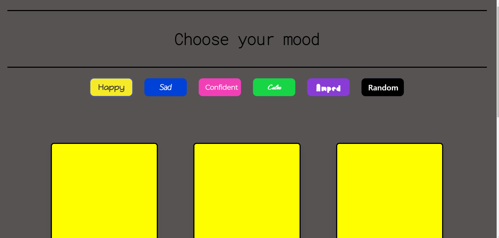
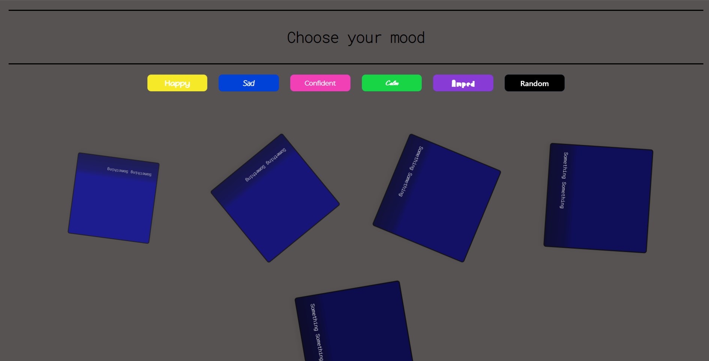

# Choose Your Mood
Choose your mood is an interactive and functional app that allows users to display a set of 5 songs from Freesound API based on their mood. The Choose Your Mood app does more than display songs, it allows users to interact with it based on any general mood they are in. 

Choose Your Mood app consists of 5 moods and 5 songs for each mood, and a random button that allows the app to choose your mood for you. It allows the user to view the song name, artist avatar, artist name, the genre it is in, and pause and play each song with the duration displayed. The app is also equipped with unique animations for displaying the cards. 

## Tech
This app uses HTML, CSS and vanilla JavaScript.

This app uses [GoogleFonts API](https://developers.google.com/fonts) and [FreeSound API](https://freesound.org/docs/api/overview.html)

## Live Website

### Contributors 
[Jack Johnson](https://github.com/JackJohnsonGH), [Michael Kendrick](https://github.com/swazunga), [Davon Brown](https://github.com/DavonHB)